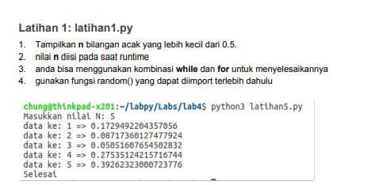
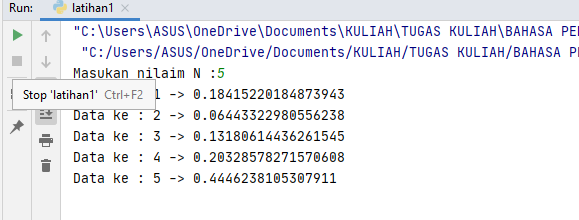
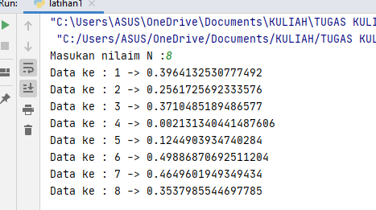
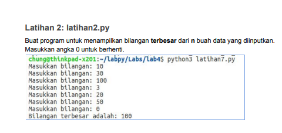

# Praktikum3_P7
Dibuat untuk memenuhi tugas Bahasa Pemrograman
<br>

Nama    : Ahmad Reiza <br>
NIM     : 312010037<br>
Kelas   : T1.20.B.1<br>
<br>
## Tugas Latihan 1

* Tugas latihan1.py, lihatlah dibawah gambar ini:<br>

 
<br>

* Saya membuat source code dari perintah diatas, seperti dibawah ini :<br>

```python
n=int(input("Masukan nilai N :"))

import random

for x in list(range(1, n+1,1)):
    print(f"data ke: {x} ->",random.uniform(0,05))
```

Saya akan menjelaskan beberapa syntax diatas: <br>
* Pada source code pertama :<br>

```python
import random
```

Fungsinya untuk memasukan function random yang ada didalam bahasa pemrograman python ke program yang telah saya buat.

* Pada source code kedua :<br>

```python
for x in list(range(1, n+1, 1))
    print(f"data ke: {x} ->", random.uniform(0,05))
```
* Funsi For adalah sebagai bentuk berulangan.
<br>

* Sedangkan untuk function range terdapat syntax default dari Python, seperti dibawah ini :<br>

>range(start, stop, step_size)<br>
>Keterangan :<br>
>-start     = Nilai awal<br>
>-stop      = Nilai akhir<br>
>-step_size = Nilai kenaikan<br>

* Function lit() fungsinya untuk membuat hasil berupa daftar baris.<br>

* Random.uniform() fungsinya untuk menampilkan bilangan float random dengan batas awal bilangan, dan abatas akhir bilangan. <br>
Pada fungsi ini penulisan syntax random.uniform() harus diisi dengan 2 nilai didalam tanda kurung, yaitu batas awal (nilai terendah).<br>

* Pada pemrograman tersebut saya menggunakan isi dalam fungsi range(1, n+1, 1), ialah :<br>
    1. Mulai saya menggunakan angka 1, karena saya ingin saat data dimuat/proses dimulai dengan angka 1<br>
    2. Berhenti saya menggunakan n+1, karena n merupakan variable dari inputan yang user masukan, saya menggunakan +1 karena default pada fungsi berhenti/stop dirange adalah nilai itu juga. sedangkan dengan fungsi n+1 datanya akan berjalan.<br>

Hasil dari program tersebut :

1. saya ingin menampilkan 5 baris bilangan dengan nilai 0 sampai 0,5<br>
    
2. saya ingin menampilkan 8 baris bilangan dengan nilai 0 sampai 0.5<br>
    
<br>
<hr>
<br>

## Tugas Latihan 2
* Tugas latihan 2, lihatlah dibawah ini:<br>
    
 <br>
 
 * Membuat source code untuk program sederhana dibawah ini : <br>
 
 ```python
xangka=0
while true:
    xbilangan = xbilangan):
    if (xangka < xbilangan):
        xangka=xbilangan
    if (xbilangan == 0)
        break
print("Bilangan terbesar adalah : ",xangka)
```
